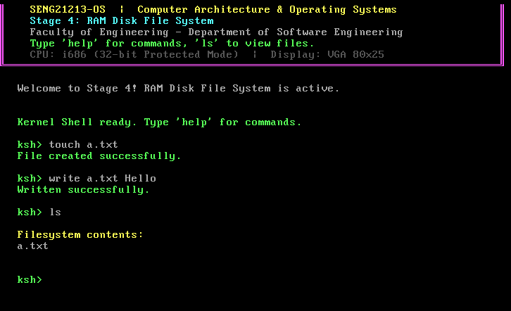
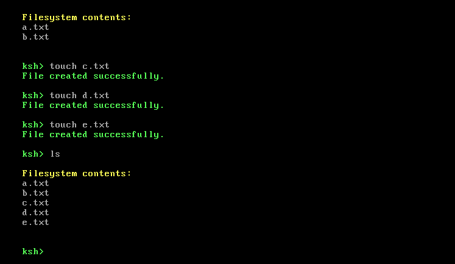

# SENG21213-OS - Stage 4: RAM Disk File System

This document outlines the implementation and testing of the RAM Disk File System (Stage 4) for SENG21213-OS, detailing the shell commands and output verifications.

---

## Filesystem Testing Commands & Verification

### 1. Creating and Writing to the First File

* **Command:** `touch a.txt`
* **Description:** Allocates an inode and a directory entry to create an empty file named `a.txt`.
* **Screenshot:**
  

* **Command:** `write a.txt Hello`
* **Description:** Writes the string `"Hello"` into `a.txt` using the allocated RAM disk data blocks.
* **Screenshot:**
  

* **Command:** `ls`
* **Description:** Lists all active files present in the file system.
* **Expected Output:** `a.txt`
* **Screenshot:**
  

---

### 2. Reading File Content

* **Command:** `cat a.txt`
* **Description:** Reads the contents of `a.txt` and outputs them to the VGA display.
* **Expected Output:** `Hello`
* **Screenshot:**
  

---

### 3. Adding a Second File and Updating State

* **Command:** `touch b.txt`
* **Description:** Creates a second file named `b.txt`.
* **Screenshot:**
  

* **Command:** `write b.txt Testing123`
* **Description:** Writes text data into `b.txt`.
* **Screenshot:**
  

* **Command:** `ls`
* **Description:** Lists the files to verify that both entries exist simultaneously.
* **Expected Output:** `a.txt`, `b.txt`
* **Screenshot:**
  

---

### 4. Deleting a File (`rm`)

* **Command:** `rm a.txt`
* **Description:** Unlinks `a.txt`, freeing its assigned blocks and inode index.
* **Screenshot:**
  

* **Command:** `ls`
* **Description:** Verifies that `a.txt` has been removed and only `b.txt` remains active.
* **Expected Output:** `b.txt`
* **Screenshot:**
  

---

### 5. Creating Multiple Files

* **Commands:** 
  ```text
  touch c.txt
  touch d.txt
  touch e.txt