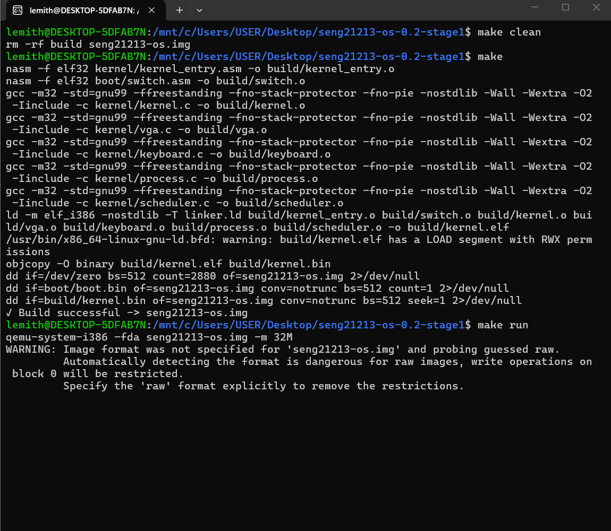

# SENG21213-OS - Stage 1: Bootloader & Initial Setup

This document outlines the implementation, build process, and execution verification for Stage 1 of SENG21213-OS.

---

## Build & Execution Process

### 1. Compilation & Build (`make`)
* **Description:** Compiles the source files and prepares the boot sector/kernel image using the project's build automation configuration.
* **Screenshot:**
  

### 2. System Status & Initialization (`ps`)
* **Description:** Verifies the initial process state or system placeholder status during early boot execution.
* **Screenshot:**
  .png)