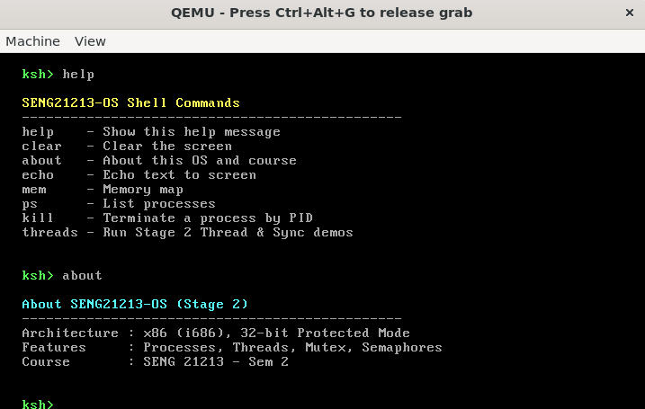
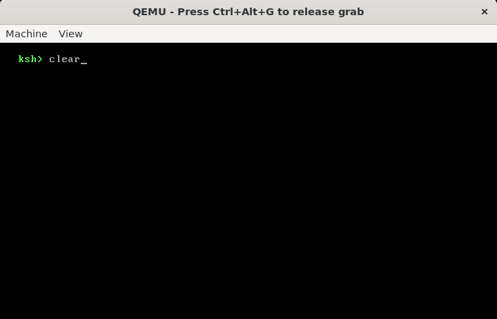

# SENG21213-OS - Stage 2: Basic Shell & Commands

This document outlines the implementation and testing of Stage 2 for SENG21213-OS, highlighting the kernel shell interface and core command utilities.

---

## Shell Commands & Verification

### 1. System Information & Overview
* **Command:** `about`
* **Description:** Displays basic metadata, version information, and system details for the current stage.
* **Screenshot:**
  

### 2. Available Commands (`help`)
* **Command:** `help`
* **Description:** Lists all supported shell commands and diagnostic utilities available in the kernel environment.
* **Screenshot:**
  .png)

### 3. Screen Management (`clear`)
* **Command:** `clear`
* **Description:** Clears the VGA text-mode display buffer, providing a clean terminal output.
* **Screenshot:**
  

### 4. Process & Thread Diagnostics (`ps`, `threads`)
* **Command:** `ps`
* **Description:** Outputs the active process list currently managed by the kernel scheduler.
* **Screenshot:**
  .png)

* **Command:** `threads`
* **Description:** Displays active execution threads and their respective states.
* **Screenshot:**
  .png)