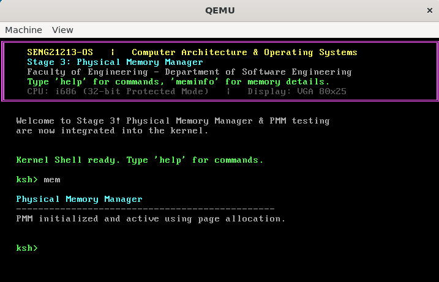
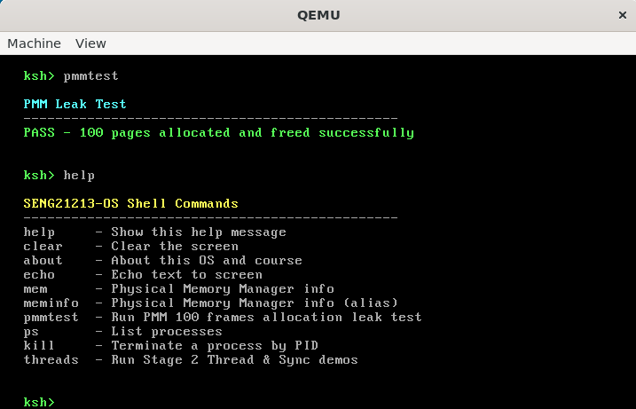
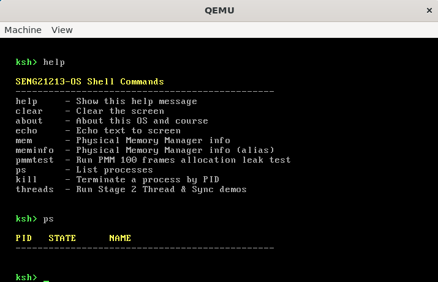
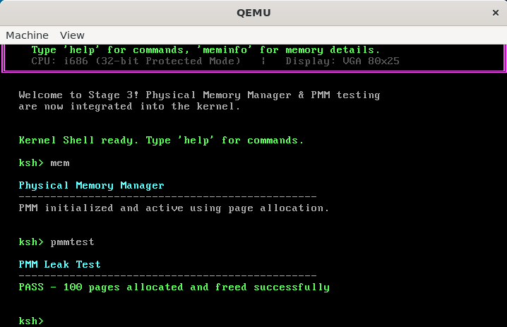
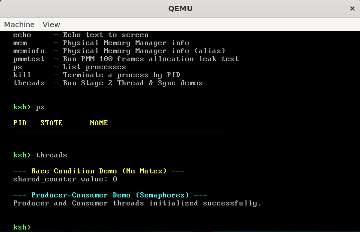

# SENG21213-OS - Stage 3: Physical Memory Manager (PMM)

This document details the implementation and verification of the Physical Memory Manager (Stage 3) for SENG21213-OS, covering BIOS E820 map parsing, bitmap frame allocation, and memory status diagnostics via shell commands.

---

## 1. Physical Memory Manager Implementation

### BIOS E820 Memory Map & Bitmap Initialization
* **Description:** The system parses the physical memory map provided by the BIOS E820 routine stored at a known address by the bootloader. A bitmap is constructed where **1 bit represents a 4 KB physical page frame**.
* **Source Files:** `pmm.c`, `pmm.h`

---

## 2. Core PMM Functions

* **`pmm_alloc_frame()`**
  * **Description:** Performs a first-fit scan across the bitmap to locate a free 4 KB frame, marks it as used, and returns its physical memory address.
* **`pmm_free_frame(paddr)`**
  * **Description:** Clears the corresponding bit in the bitmap for the specified physical address, returning the frame to the free pool.

---

## 3. Shell Commands & Verification

### Memory Statistics (`meminfo`)
* **Command:** `meminfo`
* **Description:** Displays summary statistics of the physical memory layout, including total, used, and free memory in megabytes (MB).
* **Screenshot:**
  

### General Kernel Diagnostics (`help` & `ps`)
* **Command:** `help`
* **Description:** Lists available kernel and shell utilities.
* **Screenshot:**
  

* **Command:** `ps`
* **Description:** Displays active system processes and threads.
* **Screenshot:**
  

---

## 4. Stress Testing & Leak Verification

* **Command / Routine:** Frame Allocation Loop Test
* **Description:** Dynamically allocates and frees 100 physical frames in a continuous loop (`pmm_alloc_frame()` / `pmm_free_frame()`) to verify allocation accuracy and ensure zero memory leaks.
* **Screenshot:**
  
* **Screenshot (Threads Verification):**
  